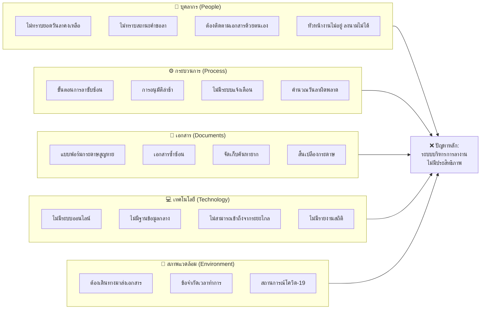

# ผังแสดงเหตุและผล (Cause-and-Effect Diagram)

## ปัญหาของระบบบริหารการลางานแบบเดิม

---

## 📋 รายละเอียดสาเหตุของปัญหาหลัก

### 👥 สาเหตุด้านบุคลากร (People)

| สาเหตุ                        | ผลกระทบ                         |
| ----------------------------- | ------------------------------- |
| ไม่ทราบยอดวันลาคงเหลือ        | ต้องสอบถาม HR ทุกครั้ง เสียเวลา |
| ไม่ทราบสถานะคำขอลา            | ไม่รู้ว่าใบลาอนุมัติหรือยัง     |
| ต้องติดตามเอกสารด้วยตนเอง     | เสียเวลาในการติดตาม             |
| หัวหน้างานไม่อยู่ ลงนามไม่ได้ | การอนุมัติล่าช้า ลาไม่ทัน       |

### ⚙️ สาเหตุด้านกระบวนการ (Process)

| สาเหตุ              | ผลกระทบ                 |
| ------------------- | ----------------------- |
| ขั้นตอนการลาซับซ้อน | กรอกแบบฟอร์มหลายขั้นตอน |
| การอนุมัติล่าช้า    | รอหลายวันกว่าจะได้คำตอบ |
| ไม่มีระบบแจ้งเตือน  | พลาดการอนุมัติ/ติดตาม   |
| คำนวณวันลาผิดพลาด   | ยอดวันลาไม่ถูกต้อง      |

### 📄 สาเหตุด้านเอกสาร (Documents)

| สาเหตุ               | ผลกระทบ                             |
| -------------------- | ----------------------------------- |
| แบบฟอร์มกระดาษสูญหาย | ต้องทำใหม่ เสียเวลา                 |
| เอกสารซ้ำซ้อน        | เก็บหลายสำเนา สับสน                 |
| จัดเก็บค้นหายาก      | หาประวัติการลาลำบาก                 |
| สิ้นเปลืองกระดาษ     | ต้นทุนสูง ไม่เป็นมิตรกับสิ่งแวดล้อม |

### 💻 สาเหตุด้านเทคโนโลยี (Technology)

| สาเหตุ                     | ผลกระทบ                         |
| -------------------------- | ------------------------------- |
| ไม่มีระบบออนไลน์           | ต้องทำด้วยตนเองทุกขั้นตอน       |
| ไม่มีฐานข้อมูลกลาง         | ข้อมูลกระจัดกระจาย ไม่เชื่อมโยง |
| ไม่สามารถเข้าถึงจากระยะไกล | ต้องมาที่สำนักงานเท่านั้น       |
| ไม่มีรายงานสถิติ           | วิเคราะห์ข้อมูลยาก              |

### 🏢 สาเหตุด้านสภาพแวดล้อม (Environment)

| สาเหตุ                 | ผลกระทบ                             |
| ---------------------- | ----------------------------------- |
| ต้องเดินทางมาส่งเอกสาร | เสียเวลา ค่าใช้จ่ายเดินทาง          |
| ข้อจำกัดเวลาทำการ      | ยื่นได้เฉพาะวันเวลาราชการ           |
| สถานการณ์โควิด-19      | ไม่สะดวกในการติดต่อแบบ Face-to-face |

---

## 🎯 สรุป: สาเหตุหลักที่ทำให้ระบบไม่มีประสิทธิภาพ

> **ปัญหาหลัก:** ระบบบริหารการลางานแบบเดิมไม่มีประสิทธิภาพ
>
> **สาเหตุหลัก:**
>
> 1. ใช้กระดาษและกระบวนการแบบ Manual
> 2. ไม่มีระบบติดตามและแจ้งเตือน
> 3. ข้อมูลกระจัดกระจาย ไม่มีฐานข้อมูลกลาง
> 4. เข้าถึงยาก ต้องมาที่สำนักงานเท่านั้น
> 5. ไม่รองรับการทำงานระยะไกล

---

## ✅ แนวทางแก้ไข: ระบบบริหารการลางานออนไลน์

พัฒนา **ระบบบริหารการลางานของบุคลากรแบบออนไลน์** เพื่อ:

- ✅ ยื่นใบลาออนไลน์ได้ทุกที่ทุกเวลา
- ✅ ตรวจสอบยอดวันลาคงเหลือได้ทันที
- ✅ ติดตามสถานะคำขอลา Real-time
- ✅ อนุมัติได้จากทุกที่ผ่านมือถือ
- ✅ มีรายงานสถิติและ Dashboard
- ✅ ลดกระดาษ รักษ์โลก
