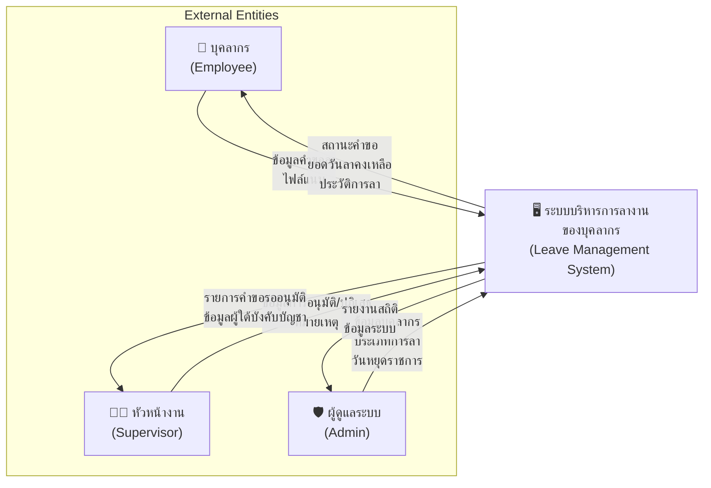
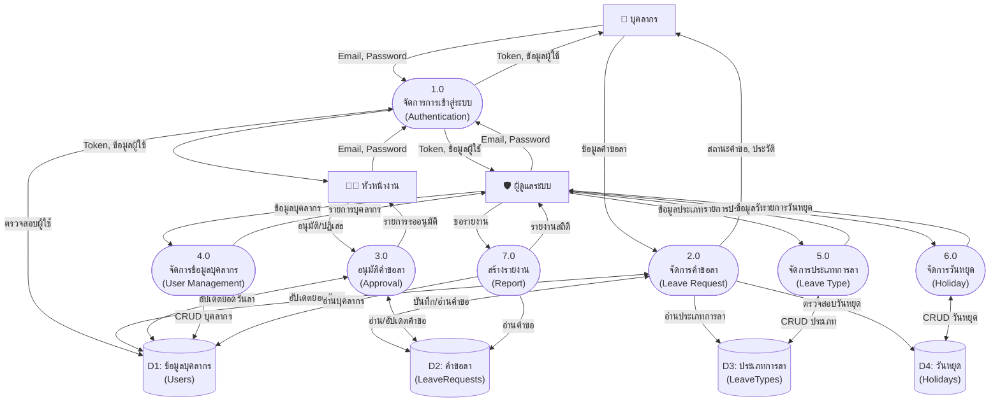

# แผนภาพบริบท (Context Diagram) และแผนภาพกระแสข้อมูล

## ระบบบริหารการลางานของบุคลากร

---

## 1. แผนภาพบริบท (Context Diagram / DFD Level 0)



### คำอธิบายแผนภาพบริบท

| External Entity | ข้อมูลที่ส่งเข้าระบบ (Input)        | ข้อมูลที่รับจากระบบ (Output)             |
| --------------- | ----------------------------------- | ---------------------------------------- |
| **บุคลากร**     | คำขอลา, ไฟล์แนบ, ข้อมูลส่วนตัว      | สถานะคำขอ, ยอดวันลาคงเหลือ, ประวัติการลา |
| **หัวหน้างาน**  | การอนุมัติ/ปฏิเสธ, หมายเหตุ         | รายการรออนุมัติ, ข้อมูลผู้ใต้บังคับบัญชา |
| **ผู้ดูแลระบบ** | ข้อมูลบุคลากร, ประเภทการลา, วันหยุด | รายงานสถิติ, ข้อมูลระบบทั้งหมด           |

---

## 2. แผนภาพกระแสข้อมูลระดับ 1 (DFD Level 1)



### คำอธิบาย Process แต่ละตัว

| Process | ชื่อ                 | คำอธิบาย                            |
| ------- | -------------------- | ----------------------------------- |
| **1.0** | จัดการการเข้าสู่ระบบ | ตรวจสอบ Email/Password, สร้าง Token |
| **2.0** | จัดการคำขอลา         | สร้าง/แก้ไข/ยกเลิกคำขอลา, ดูประวัติ |
| **3.0** | อนุมัติคำขอลา        | อนุมัติ/ปฏิเสธคำขอ, หักยอดวันลา     |
| **4.0** | จัดการข้อมูลบุคลากร  | CRUD ข้อมูลบุคลากร, กำหนดหัวหน้างาน |
| **5.0** | จัดการประเภทการลา    | CRUD ประเภทการลา, กำหนดจำนวนวัน     |
| **6.0** | จัดการวันหยุด        | CRUD วันหยุดราชการ                  |
| **7.0** | สร้างรายงาน          | รายงานสถิติ, Export Excel/PDF       |

### คำอธิบาย Data Store

| Data Store | ชื่อ          | ข้อมูลที่จัดเก็บ                     |
| ---------- | ------------- | ------------------------------------ |
| **D1**     | Users         | ข้อมูลบุคลากร, ยอดวันลาคงเหลือ, Role |
| **D2**     | LeaveRequests | คำขอลา, สถานะ, ไฟล์แนบ               |
| **D3**     | LeaveTypes    | ประเภทการลา, จำนวนวันเริ่มต้น        |
| **D4**     | Holidays      | วันหยุดราชการ                        |

---

## 3. สรุปกระแสข้อมูลหลัก

### กระบวนการยื่นคำขอลา

```
บุคลากร → [ข้อมูลคำขอลา] → 2.0 จัดการคำขอลา → [บันทึกคำขอ] → D2 คำขอลา
```

### กระบวนการอนุมัติ

```
D2 คำขอลา → [คำขอรออนุมัติ] → 3.0 อนุมัติ → [ผลการอนุมัติ] → หัวหน้างาน
                                    ↓
                            [อัปเดตยอดวันลา] → D1 บุคลากร
```

### กระบวนการสร้างรายงาน

```
ผู้ดูแลระบบ → [ขอรายงาน] → 7.0 สร้างรายงาน ← [อ่านข้อมูล] ← D1, D2
                                ↓
                         [รายงาน Excel/PDF]
```
